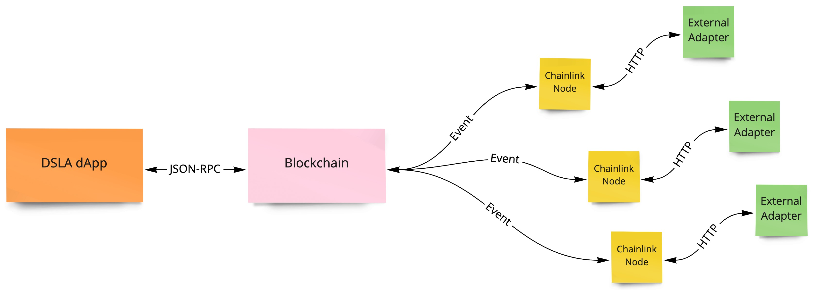

# System architecture

**DSLA DApp:**

The DApp front end, is live at [https://dsla.network](https://dsla.network).  
It is an interface between the user and the blockchain state and contracts.

**Blockchain:**

The underlying blockchain were the contracts are deployed.

**Chainlink nodes:**

The oracles to communicate with the external world.

**External adapter:**

The service that calculates the real world metrics and returns it to blockchain so the SLA settlements can be executed.

\*\*\*\*

